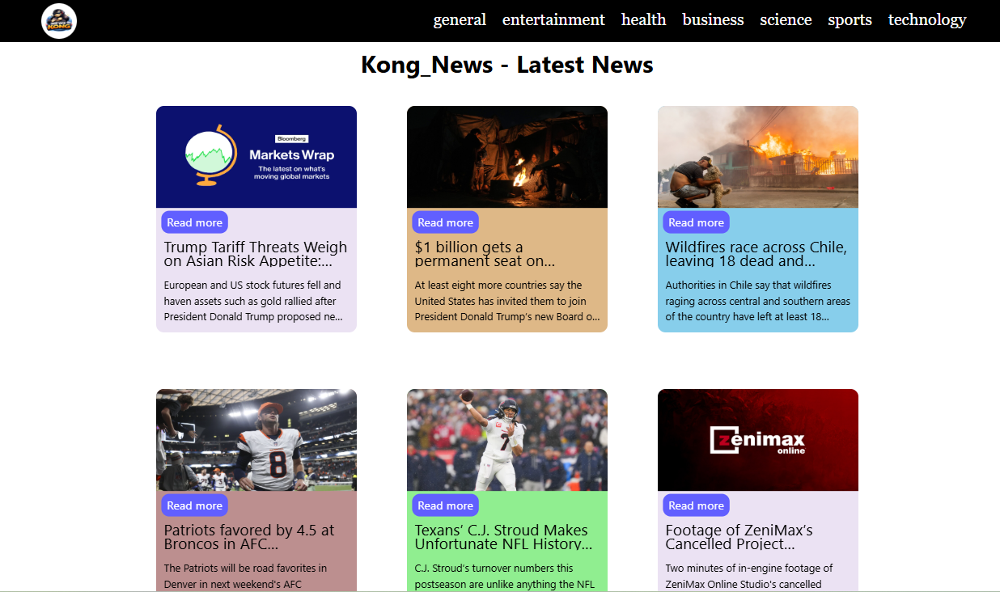
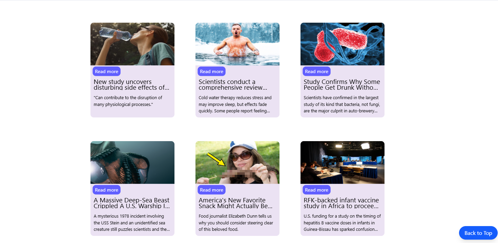
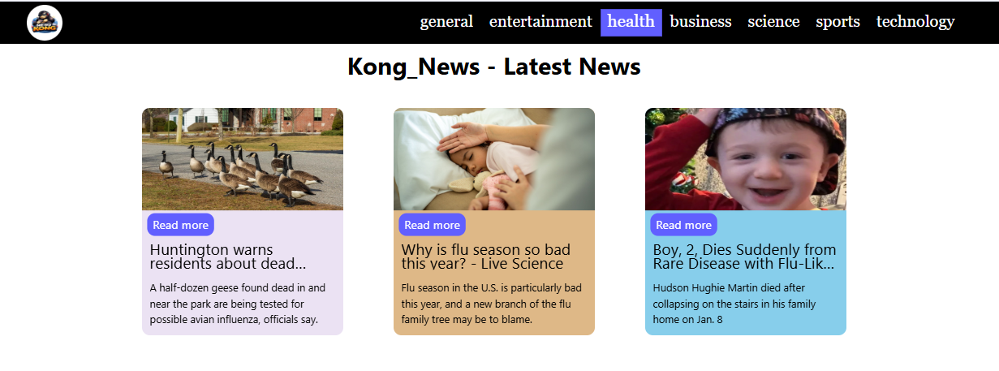

# News Kong  
A modern, fast, and visually engaging news application delivering real-time headlines with a unique 3D “Kong-style” branding.

## 📌 Overview
News Kong is a dynamic news application designed to provide users with the latest updates across multiple categories, including Technology, Sports, Entertainment, Business, and International news. The app focuses on delivering clean UI, fast fetching, and a bold, distinctive brand identity.

This project demonstrates API integration, clean UI/UX design, modular coding structure, and mobile-friendly responsiveness.

## 🚀 Key Features
- Real-time news fetching using a public news API
- Category-based filtering (Trending, Tech, Sports, Business, etc.)
- Lightweight and fast loading UI
- Fully responsive design for desktop and mobile
- 3D-style “Kong” logo identity and branding
- Organized card-based news display  
- Error handling and fallback UI for API downtime

## 🛠️ Tech Stack
**Frontend:** HTML, CSS, JavaScript   
**API Source:** News API 
**Tools:** GitHub, VS Code, Fetch API  

## 📂 Project Structure
```
news-kong/
 ├── assets/
 │    ├── logo/
 ├── css/
 │    └── styles.css
 ├── js/
 │    └── Api.js
 ├── index.html
 ├── README.md
```

## 📸 Screenshots
```




```

## ✨ Use Cases
- Personal news reader
- College project demonstrating API usage
- Prototype for a full-scale news portal
- Portfolio showcase for frontend/API development

## 🔐 Security & Best Practices
- API Key stored securely (environment variables recommended)
- Clean error handling for failed API responses
- Input-validated search functionality
- No sensitive data stored on client

## 🧪 Testing
- Manual UI testing (mobile + desktop)
- API response validation
- Link and image load testing
- Responsiveness testing across devices

## 🗺️ Future Enhancements
- AI-powered personalized news feed
- Offline reading mode
- Bookmark / Save-for-Later functionality
- Dark mode toggle
- Multi-language support
- Push notifications for breaking news

## 📅 Project Status
Completed – Version 1.0  
Actively improving for future releases.

## 👤 Author
**SK**  
GitHub: https://github.com/LittleCoder-SK  
Email:  soluk224@gmail.com

## 📄 License
This project is open-source and available under the MIT License.
